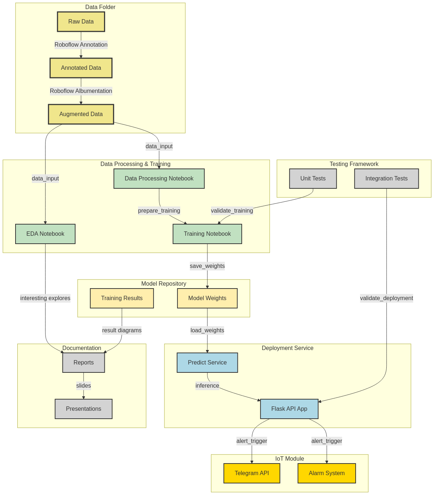

# Fire Detection System  
  
[](https://www.python.org/)  
[](https://www.pytorch.org)  
[](https://ultralytics.com/)  
  
## 📋 Overview  
  
This project implements a real-time fire detection system using computer vision and deep learning techniques. The system captures video from a webcam, processes the frames to detect fire using a YOLOv8 model, and displays the results in real-time. When a fire has been detected continuously for 12 frames, the system sends an alert via Telegram to notify users of the potential fire hazard.  
  
### Key Features  
  
- **Real-time Fire Detection**: Processes video frames to identify fire in real-time  
- **YOLOv8-based Model**: Uses state-of-the-art object detection for accurate fire identification  
- **Telegram Notifications**: Sends alerts when fire is detected for a sustained period  
- **Modular Architecture**: Well-organized codebase for easy maintenance and extension  
  
## 🏗️ System Architecture  
  
<center>  
  
</center>  
  
The system follows a modular architecture with clear separation of concerns:  
  
1. **Data Processing**: Handles data collection, annotation, and augmentation  
2. **Model Training**: Trains and optimizes the YOLOv8 model for fire detection  
3. **Detection System**: Processes video frames and applies the trained model  
4. **Alert System**: Sends notifications when fire is detected  
  
## 📂 Repository Structure  
  
```bash  
FireDetectionSystem/    
├── data/    
│   ├── raw/                 # Raw images/videos from cameras    
│   ├── processed/           # Labeled datasets (YOLO format)    
│   └── augmented/           # Augmented data (rotated, noised, etc.)    
│    
├── docs/    
│   ├── presentations/       # Demo slides and project updates    
│   └── reports/             # EDA, test results, and final report    
│    
├── models/                  # YOLOv8 weights (e.g., best.pt)    
│    
├── src/    
│   ├── data_processing.ipynb # Scripts for data augmentation     
│   │    
│   ├── train_model.ipynb    # YOLOv8 training & validation    
│   │    
│   ├── EDA.ipynb            # Exploratory Data Analysis    
│   │    
│   └── iot/                 # Telegram alert integration    
│       ├── telegram_api.py    
│       └── alarm_system.py    
│         
├── tests/                   # Unit & integration tests    
│   ├── unit/    
│   └── integration/    
│    
├── deployment/              # Deployment with Flask API  
│   ├── predict.py                
│   └── app.py   
│  
├── .gitignore    
├── requirements.txt         # Python dependencies    
├── Dockerfile    
├── LICENSE    
└── README.md                # This file

---

# 🔍 Component Details

## 1. Data Management (`data/`)

The `data` directory contains all datasets used for training and testing the fire detection model:

* **Raw Data (`raw/`)**: Original, unprocessed images and videos collected from various sources
* **Processed Data (`processed/`)**: Annotated datasets in YOLO format, prepared using Roboflow
* **Augmented Data (`augmented/`)**: Enhanced datasets created through various augmentation techniques to improve model robustness

## 2. Source Code (`src/`)

The source code is organized by functionality:

* **Data Processing (`data_processing.ipynb`)**: Preprocessing raw data, applying augmentations, converting to YOLO format
* **Model Training (`train_model.ipynb`)**: Training YOLOv8 models, hyperparameter optimization, and evaluation
* **Exploratory Data Analysis (`EDA.ipynb`)**: Analysis of dataset characteristics and distributions
* **IoT Integration (`iot/`)**: Implementation of the Telegram alert system for fire notifications

## 3. Model Storage (`models/`)

Contains trained model weights and configurations:

* `best.pt`: Best-performing YOLOv8 weights for fire detection
* Additional model versions may be stored for comparison or specialized use cases

## 4. Deployment (`deployment/`)

Contains scripts for deploying the fire detection system:

* **Prediction Module (`predict.py`)**: Handles loading the model and making predictions
* **Web API (`app.py`)**: Flask-based API for web integration

## 5. Documentation (`docs/`)

Comprehensive project documentation:

* **Presentations**: Slides and materials for demos
* **Reports**: Detailed analysis, test results, and final documentation

---

# 🔬 Model Training Pipeline

The fire detection model is trained using a comprehensive pipeline:

1. Raw Data Collection
2. Data Annotation
3. Data Preprocessing
4. Data Augmentation
5. YOLOv8 Training
6. Hyperparameter Optimization
7. Model Evaluation
8. Export Best Model
9. Integration Testing

## Training Process

Implemented in `train_model.ipynb`:

* **Data Preparation**: Convert raw fire images to YOLO format
* **Model Configuration**: Set up YOLOv8 with required parameters
* **Training Loop**: Optimize weights through multiple epochs
* **Hyperparameter Tuning**: Use Optuna to find optimal values
* **Evaluation**: Assess model with mAP50, precision, recall
* **Model Export**: Save best model for deployment

## Performance Metrics

| Metric          | Description                           | Target Value |
| --------------- | ------------------------------------- | ------------ |
| mAP50           | Mean Average Precision at IoU = 0.5   | > 0.85       |
| mAP50-95        | mAP over various IoU thresholds       | > 0.65       |
| Precision       | TP / (TP + FP)                        | > 0.90       |
| Recall          | TP / (TP + FN)                        | > 0.85       |
| F1-Score        | Harmonic mean of precision and recall | > 0.87       |
| Inference Speed | Frames per second on target hardware  | > 15 FPS     |

---

# 🚀 Getting Started

## Prerequisites

* Python 3.9 or higher
* CUDA-compatible GPU (recommended for training)
* Webcam (for real-time detection)

## Installation

Clone the repository:

```bash
git clone https://github.com/GalaxyAnnihilator/FireDetectionSystem
cd FireDetectionSystem
```

Install dependencies:

```bash
pip install -r requirements.txt
```

Download pre-trained weights (optional):

> You can download pre-trained weights from the [releases page](https://github.com/GalaxyAnnihilator/FireDetectionSystem/releases).

---

## Usage

### Running the Detection System

Start the web interface:

```bash
python deployment/app.py
```

This launches a Flask server that processes webcam input and displays detection results.

### Training Your Own Model

1. Prepare your dataset in the `data/` directory
2. Open and run `src/train_model.ipynb` in Jupyter Notebook
3. Follow the notebook instructions to train the model

The best weights will be saved as `models/best.pt`.

---

## Configuring Telegram Alerts

1. Create a Telegram bot using **BotFather**
2. Get your **bot token** and **chat ID**
3. Configure them in `src/iot/telegram_api.py`

---

# 🧪 Testing

The project includes comprehensive tests:

* **Unit Tests**: Test individual components
* **Integration Tests**: Test component interactions

To run tests:

```bash
python -m pytest tests/
```

---

# 📚 Additional Resources

* **Model Training Pipeline**: Detailed guide on the training process
* **Dataset Preparation**: Instructions for dataset creation and augmentation
* **Hyperparameter Optimization**: Advanced tuning with Optuna

---

# 📜 License  
MIT License. See [LICENSE](LICENSE) for details.

